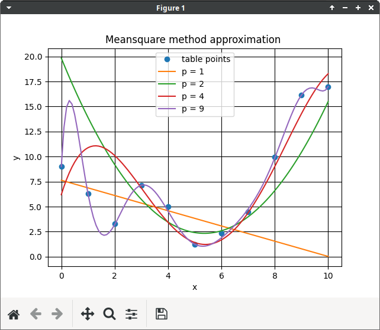

# Лабораторная работа №4

**Тема:** Построение и программная реализация алгоритма наилучшего
среднеквадратичного приближения.

**Цель работы:** Получение навыков построения алгоритма метода
наименьших квадратов с использованием полинома заданной степени
при аппроксимации табличных функций с весами.

## 1. Исходные данные

1. Таблица функции с весами с количеством узлов N. Сформировать таблицу
самостоятельно со случайным разбросом точек.

|   X   |   Y   | Вес |
|-------|-------|-----|
|  0.00 |  9.00 |  1  |
|  1.00 |  6.28 |  1  |
|  2.00 |  3.30 |  1  |
|  3.00 |  7.14 |  1  |
|  4.00 |  5.00 |  1  |
|  5.00 |  1.23 |  1  |
|  6.00 |  2.34 |  1  |
|  7.00 |  4.50 |  1  |
|  8.00 |  9.98 |  1  |
|  9.00 | 16.13 |  1  |
| 10.00 | 17.00 |  1  |

Предусмотреть в интерфейсе удобную возможность изменения пользователем весов в
таблице.

2. Степень аппроксимирующего полинома - n.

n = 1, 2 ,4, 9

## 2. Код программы

### Листинг 1. main.py

```python
from sys import argv
from typing import Tuple

import matplotlib.pyplot as plt

from meansquare import *


def read_points(fname: str) -> List[Point]:
    dots = []

    with open(fname) as fin:
        for line in fin.readlines():
            dots += [Point(*list(map(float, line.split()[:3])))]

    return dots


def print_points(dots: List[Point]) -> None:
    print("| {:>8s} | {:>8} | {:>8} |".format("X", "Y", "Weight"))
    print("| {:>8s} | {:>8} | {:>8} |".format('-' * 8, '-' * 8, '-' * 8))
    for i in dots:
        print("| {:8.2f} | {:8.2f} | {:8.2f} |".format(i.x, i.y, i.weight))


def plot(dots: List[Point], approx: List[Tuple[int, List[Point]]]) -> None:
    x, y = [p.x for p in dots], [p.y for p in dots]
    plt.clf()

    plt.title("Meansquare method approximation ")
    plt.xlabel("x")
    plt.ylabel("y")
    plt.grid(which='minor', color='k', linestyle=':')
    plt.grid(which='major', color='k')

    plt.plot(x, y, "o", label = "table points")

    for a in approx:
        plt.plot([p.x for p in a[1]], [p.y for p in a[1]],
                 label="p = {:d}".format(a[0]))

    plt.legend()
    plt.show()


def main():
    dots = read_points(argv[1])

    print("Points from file {:s}".format(argv[1]))
    print_points(dots)

    approxs = []
    for deg in [1, 2, 4, 9]:
        slae = SLAE().build(dots, deg)
        slae = slae.solve()
        approxs.append((deg, Approx().get_coeffs(slae).build(dots)))

    plot(dots, approxs)


if __name__ == "__main__":
    main()
```

### Листинг 2. meansquare.py

```python
from __future__ import annotations

import numpy as np
from typing import List


class Point:
    def __init__(self, _x: float, _y: float, _w: float):
        self.x = _x
        self.y = _y
        self.weight = _w


class SLAE:
    mat: List[List[float]]
    n: int

    def build(self, ds: List[Point], _n: int) -> SLAE:
        self.n = _n
        self.mat = [[0 for _ in range(self.n + 2)] for _ in range(self.n + 1)]

        for i in range(self.n + 1):
            for j in range(self.n + 1):
                slae_coeffs = 0.0
                expanded_coeff = 0.0
                for k in range(len(ds)):
                    slae_coeffs += (ds[k].weight
                                    * (ds[k].x ** i)
                                    * (ds[k].x ** j))
                    expanded_coeff += ds[k].weight * ds[k].y * (ds[k].x ** i)

                self.mat[i][j] = slae_coeffs
                self.mat[i][self.n + 1] = expanded_coeff

        return self

    def solve(self) -> List[List[float]]:
        for i in range(self.n + 1):
            for j in range(self.n + 1):
                if i == j:
                    continue

                sub_coeff = self.mat[j][i] / self.mat[i][i]
                for k in range(self.n + 2):
                    self.mat[j][k] -= sub_coeff * self.mat[i][k]

        for i in range(self.n + 1):
            divider = self.mat[i][i]
            for j in range(self.n + 2):
                self.mat[i][j] /= divider

        return self.mat


class Approx:
    def __init__(self):
        self.coeffs = []

    def get_coeffs(self, mat: List[List[float]]) -> Approx:
        self.coeffs = [mat[i][len(mat)] for i in range(len(mat))]

        return self

    def build(self, ds: List[Point]) -> List[Point]:
        dots = []

        for i in np.arange(ds[0].x, ds[-1].x + 0.1, 0.1):
            d = Point(i, 0, 0)

            for j in range(len(self.coeffs)):
                d.y += d.x ** j * self.coeffs[j]

            dots += [d]

        return dots
```

## 3. Результаты работы

### 3.1. Веса всех точек равны единице

|        X |        Y |   Weight |
| -------- | -------- | -------- |
|     0.00 |     9.00 |     1.00 |
|     1.00 |     6.28 |     1.00 |
|     2.00 |     3.30 |     1.00 |
|     3.00 |     7.14 |     1.00 |
|     4.00 |     5.00 |     1.00 |
|     5.00 |     1.23 |     1.00 |
|     6.00 |     2.34 |     1.00 |
|     7.00 |     4.50 |     1.00 |
|     8.00 |     9.98 |     1.00 |
|     9.00 |    16.13 |     1.00 |
|    10.00 |    17.00 |     1.00 |


### 3.2. Веса всех точек разные

|        X |        Y |   Weight |
| -------- | -------- | -------- |
|     0.00 |     9.00 |    12.00 |
|     1.00 |     6.28 |     6.00 |
|     2.00 |     3.30 |     5.00 |
|     3.00 |     7.14 |     4.00 |
|     4.00 |     5.00 |     7.00 |
|     5.00 |     1.23 |    11.00 |
|     6.00 |     2.34 |     8.00 |
|     7.00 |     4.50 |     3.00 |
|     8.00 |     9.98 |    10.00 |
|     9.00 |    16.13 |     4.00 |
|    10.00 |    17.00 |     2.00 |


### 3.3. Изменения угла наклона прямой за счет разных весов точек

|        X |        Y |   Weight |
| -------- | -------- | -------- |
|     0.00 |     9.00 |     1.00 |
|     1.00 |     6.28 |     1.00 |
|     2.00 |     3.30 |     1.00 |
|     3.00 |     7.14 |    50.00 |
|     4.00 |     5.00 |     1.00 |
|     5.00 |     1.23 |    50.00 |
|     6.00 |     2.34 |     1.00 |
|     7.00 |     4.50 |     1.00 |
|     8.00 |     9.98 |     1.00 |
|     9.00 |    16.13 |     1.00 |
|    10.00 |    17.00 |     1.00 |



## 4. Вопросы по защите лабораторой работы

1. Что произойдет при задании степени полинома `n=N-1` \
(числу узлов таблицы минус 1)?

График полинома будет проходить через все заданные точки. Веса не будет
оказывать никакого влияния.

2. Будет ли работать Ваша программа при `n >= N` ? Что именно в алгоритме требует
отдельного анализа данного случая и может привести к аварийной остановке?

Работать программа будет, но начиная с `n = N` уравнения не будут линейно
независимыми. Аварийная основка программы может произойти из-за деления на 0.

3. Получить формулу для коэффициента полинома a\_0 при степени полинома n=0. Какой
смысл имеет величина, которую представляет данный коэффициент?


Данный коэффициент будет являться взвешенным средним арифметическим ординат
функции.

4. Записать и вычислить определитель матрицы СЛАУ для нахождения коэффициентов
полинома для случая, когда n=N=2. Принять все `ρ_i = 1`.


Так как определитель матрицы равен нулю, система не имеет решений.

5. Построить СЛАУ при выборочном задании степеней аргумента полинома
`φ(x) = a_0 + a_1 * x^m + a_2 * x^n`, причем степени n и m
в этой формуле известны.


6. Предложить схему алгоритма решения задачи из вопроса 5, если степени n и m
подлежат определению наравне с коэффициентами a k , т.е. количество неизвестных
равно.

Решить можно полным перебором n и m, для каждой пары которой ищем коээфициенты
`a_i` и ошибку. Результатом будет считать тот случай, при котором ошибка
минимальна.
