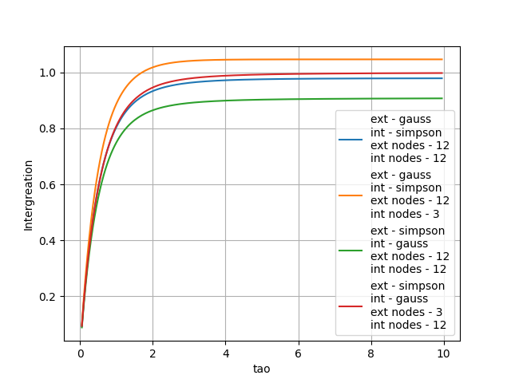
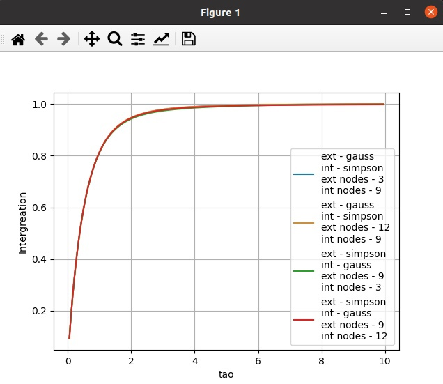

# Лабораторная работа №5

**Тема:** Построение и программная реализация алгоритмов численного
интегрирования.

**Цель работы:** Получение навыков построения алгоритма вычисления двукратного
интеграла с использованием квадратурных формул Гаусса и Симпсона.

## 1. Исходные данные

Построить алгоритм и программу для вычисления двукратного интеграла при
фиксированном значении параметра τ


θ, φ - углы сферических координат.

Применить метод последовательного интегрирования. По одному направлению
использовать формулу Гаусса, а по другому - формулу Симпсона.

## 2. Код программы

### Листинг 1. main.py

```python
import matplotlib.pyplot as plt
from math import sin, cos, pi, exp
from gauss import gauss
from simpson import simpson


def tao_func(tao):
    sub_func = lambda phi, teta: ((2 * cos(teta)) /
            (1 - sin(teta) * sin(teta) * cos(phi) * cos(phi)))
    return lambda phi, teta: (4 / pi * (1 - exp(-tao * sub_func(phi, teta))) *
            cos(teta) * sin(teta))


def func_2_to_1(func, value):
    return lambda y: func(value, y)


def double_integreation(double_func, limits, nodes_counts, integreate_funcs):
    F = lambda y: integreate_funcs[1](func_2_to_1(double_func, y),
            limits[1][0], limits[1][1], nodes_counts[1])
    return integreate_funcs[0](F, limits[0][0], limits[0][1], nodes_counts[0])


def plot_graphic(integr_func, tao_start, tao_end, tao_step, label):
    plt.figure(1)

    x = []
    tao = tao_start
    while tao <= tao_end:
        x.append(tao)
        tao += tao_step
    
    plt.plot(x, [integr_func(tao) for tao in x], label=label)

    plt.xlabel("tao")
    plt.ylabel("Intergreation")
    plt.grid(True)
    plt.legend(loc=0)


def gen_label(func1, func2, N, M):
    label = ""
    if (func1 == gauss):
        label += "ext - gauss\n"
    else:
        label += "ext - simpson\n"
    if (func2 == gauss):
        label += "int - gauss\n"
    else:
        label += "int - simpson\n"
    
    label += f"ext nodes - {N}\nint nodes - {M}"

    return label


def test_simpson():
    func1 = gauss
    func2 = simpson

    int_func1 = lambda tao: double_integreation(tao_func(tao),
            [[0, pi/2], [0, pi/2]], [10, 9], [func1, func2])
    int_func2 = lambda tao: double_integreation(tao_func(tao),
            [[0, pi/2], [0, pi/2]], [10, 3], [func1, func2])
    int_func3 = lambda tao: double_integreation(tao_func(tao),
            [[0, pi/2], [0, pi/2]], [9, 10], [func2, func1])
    int_func4 = lambda tao: double_integreation(tao_func(tao),
            [[0, pi/2], [0, pi/2]], [3, 10], [func2, func1])

    plot_graphic(int_func1, 0.05, 10, 0.05, gen_label(func1, func2, 10, 9))
    plot_graphic(int_func2, 0.05, 10, 0.05, gen_label(func1, func2, 10, 3))
    plot_graphic(int_func3, 0.05, 10, 0.05, gen_label(func2, func1, 9, 10))
    plot_graphic(int_func4, 0.05, 10, 0.05, gen_label(func2, func1, 3, 10))


def test_gauss():
    func1 = gauss
    func2 = simpson

    int_func1 = lambda tao: double_integreation(tao_func(tao),
            [[0, pi/2], [0, pi/2]], [3, 9], [func1, func2])
    int_func2 = lambda tao: double_integreation(tao_func(tao),
            [[0, pi/2], [0, pi/2]], [10, 9], [func1, func2])
    int_func3 = lambda tao: double_integreation(tao_func(tao),
            [[0, pi/2], [0, pi/2]], [9, 3], [func2, func1])
    int_func4 = lambda tao: double_integreation(tao_func(tao),
            [[0, pi/2], [0, pi/2]], [9, 10], [func2, func1])

    plot_graphic(int_func1, 0.05, 10, 0.05, gen_label(func1, func2, 3, 9))
    plot_graphic(int_func2, 0.05, 10, 0.05, gen_label(func1, func2, 10, 9))
    plot_graphic(int_func3, 0.05, 10, 0.05, gen_label(func2, func1, 9, 3))
    plot_graphic(int_func4, 0.05, 10, 0.05, gen_label(func2, func1, 9, 10))


def main():
    tao = float(input("Input tao: "))
    N = int(input("Input N: "))
    M = int(input("Input M: "))

    method_select = bool(int(input(
        "select external method (0 - simpson, 1 - gauss): ")))
    func1 = gauss if method_select else simpson
    method_select = bool(int(input(
        "select internal method (0 - simpson, 1 - gauss): ")))
    func2 = gauss if method_select else simpson

    integr_func = lambda tao: double_integreation(tao_func(tao),
            [[0, pi/2], [0, pi/2]], [N, M], [func1, func2])
    print(f"Integreation res: {integr_func(tao)}")

    test = int(input("select test (0 - no test, 1 - simpson, 2 - gauss): "))
    if test == 0:
        plot_graphic(integr_func, 0.05, 10, 0.01,
                     gen_label(func1, func2, N, M))
    elif test == 1:
        test_simpson()
    elif test == 2:
        test_gauss()

    plt.show()


if __name__ == "__main__":
    main()
```

### Листинг 2. gauss.py

```python
from math import fabs


def mul_polynoms(pol1, pol2):
    res_pol = [0 for i in range(len(pol1) + len(pol2) - 1)]

    for i in range(len(pol1)):
        for j in range(len(pol2)):
            res_pol[i + j] += pol1[i] * pol2[j]
    
    return res_pol


def diff_polynoms(pol1, pol2):
    max_len = max(len(pol1), len(pol2))
    res_pol = [0 for i in range(max_len)]

    for i in range(len(pol1)):
        res_pol[i + len(res_pol) - len(pol1)] += pol1[i]

    for i in range(len(pol2)):
        res_pol[i + len(res_pol) - len(pol2)] -= pol2[i]
    
    return res_pol


def polynom_value(pol, x):
    res = 0
    for i in range(len(pol)):
        res += pol[i] * (x ** (len(pol) - i - 1))
    
    return res


def find_legandr_pol(n):
    leg_pol_0 = [1] #1
    leg_pol_1 = [1, 0] #x

    prev = leg_pol_0
    res_pol = leg_pol_1

    for power in range(2, n + 1):
        coef_1 = [(2 * power - 1) / power, 0] #(2 ^ power - 1 / power) * x
        coef_2 = [(power - 1) / power] # (power - 1) / power
        mul_pol1 = mul_polynoms(coef_1, res_pol)
        mul_pol2 = mul_polynoms(coef_2, prev)
        tmp = [x for x in res_pol]
        res_pol = diff_polynoms(
                mul_polynoms(coef_1, res_pol), mul_polynoms(coef_2, prev))
        prev = [x for x in tmp]

    return res_pol


def half_mid_division(pol, left, right):
    mid = left + (right - left) / 2
    res = polynom_value(pol, mid)
    while fabs(res) > 1e-5:
        if res * polynom_value(pol, left) < 0:
            right = mid
        else:
            left = mid
        mid = left + (right - left) / 2
        res = polynom_value(pol, mid)

    return mid


def find_roots(leg_pol):
    n = len(leg_pol) - 1
    parts = 2 * n
    is_find_segments = False

    while (not is_find_segments):
        segments = []
        step = 2 / parts

        x = -1
        for i in range(parts - 1):
            if (polynom_value(leg_pol, x)*polynom_value(leg_pol, x + step) < 0
                    or polynom_value(leg_pol, x) == 0):
                segments.append([x, x + step])
            x += step
        if (polynom_value(leg_pol, x) * polynom_value(leg_pol, 1) < 0 or
            polynom_value(leg_pol, x) == 0):
            segments.append([x, 1])

        if len(segments) == n:
            is_find_segments = True

    return [half_mid_division(leg_pol, seg[0], seg[1]) for seg in segments]


def solve_slau(slau):
    for i in range(len(slau)):
        tmp = slau[i][i]
        for j in range(len(slau[0])):
            slau[i][j] /= tmp
        
        for j in range(i + 1, len(slau)):
            tmp = slau[j][i]
            for k in range(len(slau[0])):
                slau[j][k] -= slau[i][k] * tmp
    
    coefs = []

    for i in range(len(slau) - 1, -1, -1):
        coef = slau[i][len(slau[0]) - 1]

        for j in range(len(coefs)):
            coef -= coefs[j] * slau[i][i + j + 1]
        
        coefs.insert(0, coef)
    
    return coefs


def find_args(roots):
    mtr = []
    for i in range(len(roots)):
        row = [root ** i for root in roots]
        if i % 2 == 1:
            row.append(0)
        else:
            row.append(2 / (i + 1))
        mtr.append(row)
    
    return solve_slau(mtr)


def convert_arg(t, a, b):
    return (b - a) / 2 * t + (b + a) / 2


def gauss(func, a, b, node_count):
    leg_pol = find_legandr_pol(node_count)
    roots = find_roots(leg_pol)
    args = find_args(roots)

    res = 0
    for i in range(node_count):
        res += (b - a) / 2 * args[i] * func(convert_arg(roots[i], a, b))
    
    return res
```

### Листинг 3. simpson.py

```python
def simpson(func, a, b, nodes_count):
    h = (b - a) / (nodes_count - 1)
    x = a
    res = 0

    for i in range((nodes_count - 1) // 2):
        res += func(x) + 4 * func(x + h) + func(x + 2 * h)
        x += 2 * h
    
    return h / 3 * res
```

## 3. Результаты работы

1. Описать алгоритм вычисления n корней полинома Лежандра n-ой степени `P_n(x)`
при реализации формулы Гаусса.

Известно, что полином Лежандра n-ой степени имеет n
различных корней на интервале [−1; 1]. Поэтому, для поиска корней нужно найти
на интервале [−1; 1] n интервалов, которые содержат в себе корень, и применить
к ним метод половинного деления.

Поиск интервалов с корнями выполняем следующим образом: разбиваем отрезок от
-1 до 1 на 2n и увеличиваем n до тех пор, пока не найдем n интервалов
с корнями. Интервал [a, b] содержит корень, если f (a) * f (b) <= 0.

При методе половинного деления мы делит отрезок пополам, смотрим на знаки
функции в середине отрезка и передвигаем границу (левую или праву) ближе к
корну. Так до тех пор, пока получаемый отрезок польше погрешности.

2. Исследовать влияние количества выбираемых узлов сетки по каждому направлению
на точность расчетов.

a) Исследование метода Симсона



Метод Симпсона работает не точно при малом количестве
узлов. Особенно это заметно при вычислении внутреннего интеграла.

б) Исследование метода Гауса



Из графика видно, что метод Гаусса работает одинаково на разном количестве
узлов.

3. Построить график зависимости ε(τ) в диапазоне изменения `τ=0.05-10`. Указать
при каком количестве узлов получены результаты.

пункт 2

## 4. Вопросы по защите лабораторой работы

1. В каких ситуациях теоретический порядок квадратурных формул численного
интегрирования не достигается.

Если подинтегральная функция не имеет соответствующих производных. Например,
если на отрезке интегрирования не существуют 3-я и 4-я производные, то порядок
точности формулы Симпсона будет только 2-ой.

2. Построить формулу Гаусса численного интегрирования при одном узле.

Полином Лежандра 1 степени: `P_1(x)=x` Корень - `t_1 = 0`. Коэффициент
`A_1 = 2`. Подставляем в формулу для вычисления интеграла и получаем:


3. Построить формулу Гаусса численного интегрирования при двух узлах.

Полином Лежандра 2 степени: `P_2(x) = 1/2 (3x^2 − 1)`. Корни: `t_1 = 1/sqrt(3)`
и `t_1 = -1/sqrt(3)`. Получим СЛАУ для вычисления коэффициентов:


Из СЛАУ получаем, что `A_1 = A_2 = 1`. Подставляем в формулу для вычисления
интеграла и получаем.


4. Получить обобщенную кубатурную формулу, аналогичную (6.6) из лекции No6, для
вычисления двойного интеграла методом последовательного интегрирования
на основе формулы трапеций с тремя узлами по каждому направлению.


Здесь,


Подставим эти выражения в первую формулу


